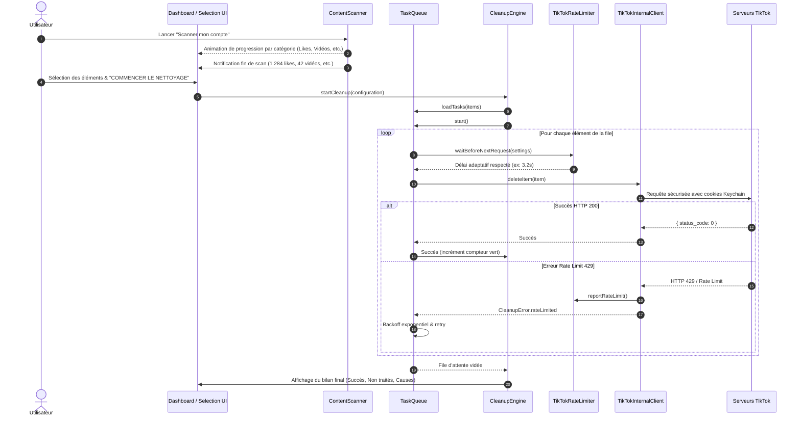

# Architecture Technique — TikTok Cleaner iOS

Ce document présente l'architecture logicielle, les couches applicatives et les flux de données de l'application **TikTok Cleaner iOS**.

---

## 1. Vue d'Ensemble de l'Architecture

L'application est conçue selon les principes de la **Clean Architecture** et du patron **MVVM (Model-View-ViewModel)** sous Swift 5.9+ et SwiftUI, avec isolation de la concurrence via les acteurs Swift (`actor`).

```
TikTokCleaner
│
├── App/                  → Point d'entrée de l'application & Injection de dépendances
├── Models/               → Modèles de données (CleanableItem, CleanupTask, CleanupError, etc.)
├── Authentication/       → Authentification In-App, OAuth 2.0 & Gestion de session
├── TikTokService/        → Endpoints, Client réseau authentifié & Limiteur de débit
├── ContentScanner/       → Découverte de contenu (GDPR JSON + Scan API en ligne)
├── LikeManager/          → Cache & sélection des vidéos aimées
├── PostManager/          → Cache & sélection des vidéos publiées
├── RepostManager/        → Cache & sélection des republications
├── FavoritesManager/     → Cache & sélection des favoris
├── CleanupEngine/        → Moteur principal de nettoyage & Coupe-circuit (Circuit Breaker)
├── TaskQueue/            → File d'attente résiliente (Pause, Reprise, Annulation, Backoff)
├── ProgressManager/      → Gestion et publication de la progression temps réel
├── SecureStorage/        → Trousseau iOS (Keychain) pour les tokens et cookies
├── Settings/             → Configuration utilisateur & paramètres de cadence
├── Logging/              → Console développeur in-app avec masquage des secrets
└── UI/                   → Interface utilisateur SwiftUI (Thème sombre sobre, Dashboard, etc.)
```

---

## 2. Diagramme des Flux d'Exécution



---

## 3. Sécurité et Gestion des Données Sensibles

L'application respecte les normes les plus strictes de sécurité iOS :

1. **Aucun Mot de Passe Stocké** : L'application n'a jamais accès au mot de passe en clair de l'utilisateur.
2. **Keychain iOS (kSecClassGenericPassword)** : Tous les jetons de session (`sessionid`, `tt_csrf_token`) sont stockés dans le trousseau système sécurisé d'Apple avec le flag `kSecAttrAccessibleAfterFirstUnlockThisDeviceOnly`.
3. **Assainissement des Logs** : La classe `AppLogger` filtre automatiquement par expressions régulières tout token, cookie ou clé secrète avant affichage ou export.
4. **Traitement Strictement Local** : Les requêtes transitent directement de l'iPhone vers les serveurs de TikTok (aucun serveur relais intermédiaire).
